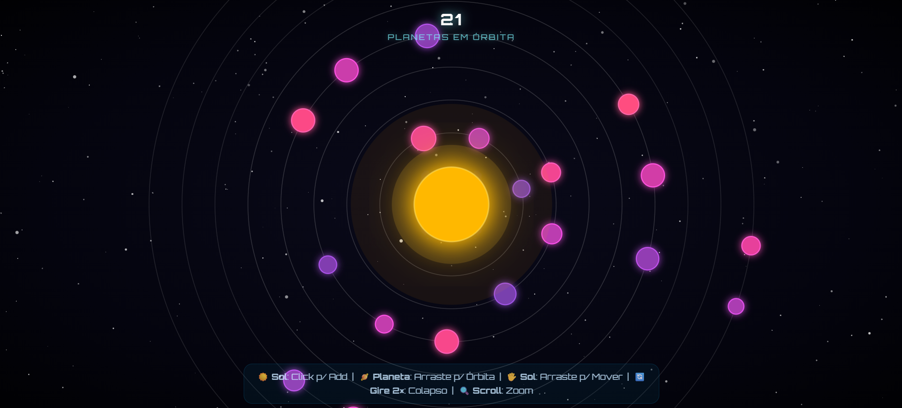

# Sistema Solar Interativo (Galeria de CC)

  

Uma representação algorítmica e lúdica de mecânicas celestes desenvolvida puramente com a biblioteca D3.js. vista em aula Este projeto explora a interseção entre simulação de física em SVG, design paramétrico e interação fluida em tempo real para o usuário.

## Submissão: Galeria de CC

**Nome da obra:** Colapso Gravitacional  
**Instrução de interação:** Clique no Sol ao centro para iterativamente gerar novos planetas. 
Arraste os planetas livremente para reposicioná-los em órbitas magnéticas adjacentes. 
Para causar um evento cataclísmico, arraste o Sol em um movimento circular em sua volta por duas voltas completas para engatilhar um colapso gravitacional.

---

## Como Executar e Explorar

O ecossistema é processado integralmente no lado do cliente, prescindindo de processos de compilação ou bundlers.

1. Navegue até o diretório do projeto e abra o arquivo diretriz (`sistema_solar.html`) utilizando um navegador atualizado.
2. Como alternativa de desenvolvimento, inicie uma instância como o Live Server do VS Code ou um host local pelo terminal Python utilizando o comando `python -m http.server`.

## Funcionalidades e Implementação com D3.js

Este projeto se baseia intensamente em abstrações modulares do D3.js v7, indo além da simples construção de gráficos para arquitetar um ambiente de manipulação vetorial direta:

- **Sistema de Zoom e Pan (`d3.zoom`):**
  Uma câmera interativa foi implementada sobre a tag `<g id="stage">`. Usando a matriz de transformação do `d3.zoomIdentity`, o usuário pode aplicar "pan" (deslocamento espacial da visualização arrastando o vazio do espaço) e "zoom" focado na posição do cursor via rolagem do mouse. Foi elaborada uma função de filtragem (`filter()`) exigente a fim de isolar estritamente eventos de zoom do fundo e liberando a interação de objetos primários em primeiro plano para *dragging*.

- **Picking Direto e Arraste Controlado (`d3.drag`):**
  A biblioteca intercepta os eventos de clique sobre vetores específicos permitindo o Picking apurado do Sol e Planetas, traduzindo coordenadas independentemente do nível de zoom da câmera usando cálculos invertidos (`d3.pointer()`). Durante a arrastabilidade planetária, aplicou-se laços trigonométricos (`Math.hypot`) para projetar o efeito de imantação ("snapping"), calculando dinamicamente e travando o objeto somente nas órbitas pré-definidas em tempo real.

- **Escalas e Geradores Visuais:**
  Para manter fluidez e um código coeso para incontáveis corpos celestes, é adotada e mapeada a função `d3.interpolateRainbow`, atritando matematicamente o índice do objeto para fracionar a escala de tonalidade. As iterações das camadas de Data Join (enter, update, exit) orquestravam uma transição ininterrupta para propriedades físicas.

- **Reconhecimento Complexo de Gestos:**
  Utiliza-se o armazenamento residual contínuo dos arcos radianos traçados no "drag" temporal para definir atitudes de sistema (Como o evento de Colapso e Dispersão), demonstrando que o D3 serve perfeitamente não apenas para traçar coordenadas finais, mas interceptar as micro-ações vetoriais de arrasto com funções de estado global.

## Desafios Interativos e Exploração

Para explorar o potencial lúdico do simulador, propomos alguns testes práticos e divertidos:

- **O Desafio dos 100 Planetas:** Clique no Sol repetidamente até esgotar o limite estrito suportado: 100 corpos celestes. 
- **Realocação Orbital (Snapping):** Selecione um planeta qualquer e arraste-o livremente pela extensão do vazio. 
- **Evocando a Dispersão e o Caos:** Arraste o Sol subitamente com toda sua força para as bordas distantes, empurrando o ecossistema para fora da tela. 

## Requisitos Técnicos Aplicados

- SVG Integrado a HTML5, fazendo uso avançado das flags nativas `feGaussianBlur` para emular difração de luz realísticamente.
- Sem *frameworks* de sobrecarga. Utiliza unicamente a engine D3, controlando animações rotativas via `requestAnimationFrame` que gerenciam de forma individual a taxa Kepleriana de revolução baseada na distância percorrida do eixo central.
